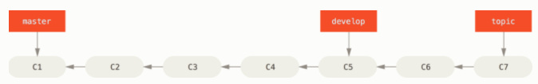
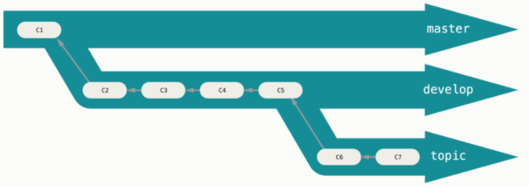
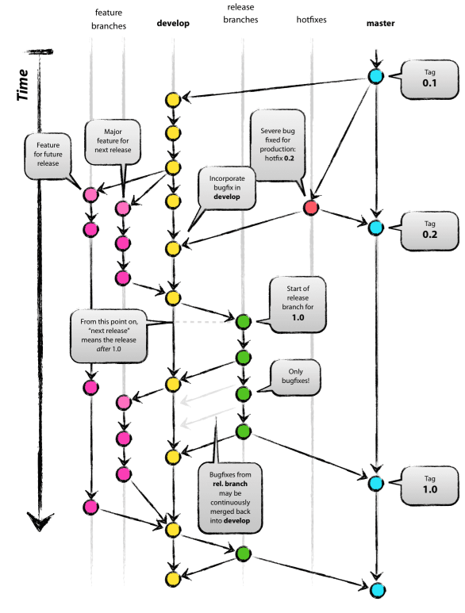

## 1. Branch Management

> git branch

If we run `git branch` width no arguments, we will get a simple listing of our current branches:

```bash
$ git branch
  iss53
* master
  testing
```

Notice the `*` character indicates the branch that our currently have checked out (i.e. the branch that `HEAD`points to)

> `git branch -v`

To see the last commit on each branch.

```bash
$ git branch -v
  iss53   93b412c fix javascript issue
* master  7a98805 Merge branch 'iss53'
  testing 782fd34 add scott to the author list in the readmes
```

> git branch --merged

To see which branches are already merged into the branch you’re on.

```shell
$ git branch --merged
  iss53
* master
```

Branches on this list without the `*` in front of them are generally fine to delete with `git branch -d`; you’ve already incorporated their work into another branch, so you’re not going to lose anything.

> git branch --no-merged

To see all the branches that contain work you haven’t yet merged in.

```bash
$ git branch --no-merged
  testing
```

Because it contains work that isn’t merged in yet, trying to delete it with `git branch -d` will fail:

```bash
$ git branch -d testing
error: The branch 'testing' is not fully merged.
If you are sure you want to delete it, run 'git branch -D testing'.
```

If you really do want to delete the branch and lose that work, you can force it with `-D`, as the helpful message points out. `git branch -D testing`

## 2. Branching Workflows

### 2.1 Long-Running Branches

Because Git uses a simple `three-way merge`, merging from one branch into another multiple times over a long period is generally easy to do. This means you can have several branches that are always open and that you use for different stages of your development cycle; you can merge regularly from some of them into others.

Many Git developers have a workflow that embraces this approach, such as having only code that is entirely stable in their `master` branch.They have another parallel branch named `develop` or `release` that they work from or use to test stability — it isn’t necessarily always stable, but whenever it gets to a stable state, it can be merged into `master`.

In reality, we’re talking about `pointers` moving up the line of commits you’re making. `The stable branches are farther down the line in your commit history, and the bleeding-edge branches are farther up the history.`



It’s generally easier to think about them as `work silos`, where sets of commits graduate to a more stable silo when they’re fully tested.



### 2.2 Git-flow



- Check more details [A successful Git branching model](https://nvie.com/posts/a-successful-git-branching-model/)

## 3. Remote Branches
